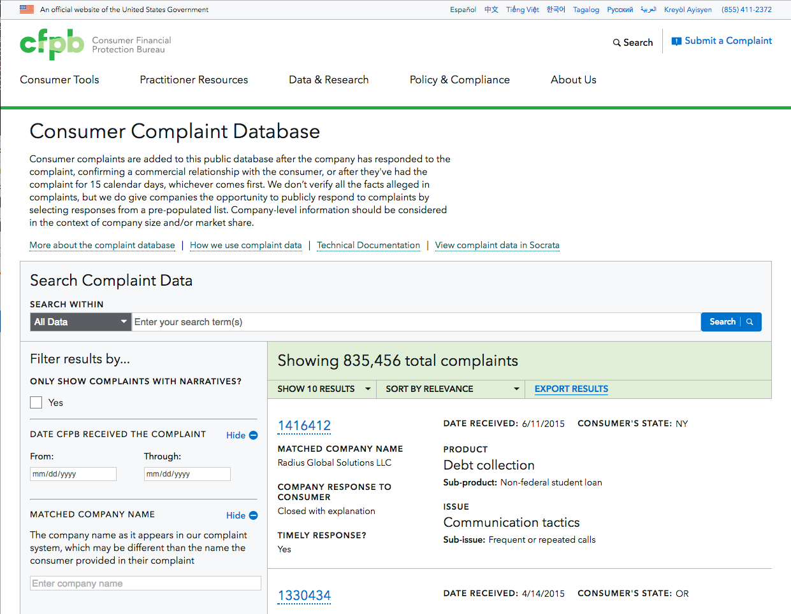

# Consumer Complaint Database - 5.0

**Description**:
This application allows consumers to search complaints submitted to the CFPB by other consumers.

#### Technology Stack

This application is written in JavaScript and [Sass](https://sass-lang.com/) within
the [React](https://facebook.github.io/react/) + [Redux](http://redux.js.org/)
framework. It uses [Webpack](http://webpack.github.io/docs/) at runtime to
manage module loading.

The code is written with the [ES6](http://es6-features.org/) feature set
of JavaScript. Backwards compatibility is achieved by compiling the script with
[Babel](https://babeljs.io/) prior to using it within the browser.

Unit testing of the application is performed within
[Jest](https://facebook.github.io/jest/) with
[Testing Library](https://testing-library.com/) providing support for event testing.

[yarn](https://yarnpkg.com/) is used to manage the build/test/deploy cycle.

#### Screenshot



## Dependencies

This application depends on the following third-party components:

1. [Capital Framework](https://cfpb.github.io/capital-framework/) - CFPB standard styling and controls
1. [History](https://github.com/reacttraining/history) - Integrating the address bar with the application
1. [dayjs](https://day.js.org/) - Better date handling than native JavaScript

It also contains portions adapted from:

1. [react-typeahead](https://github.com/fmoo/react-typeahead)

## Installation

Instructions on how to install, configure, and get the project running
are in the [INSTALL](INSTALL.md) document.

## Configuration

Please see the subsection Configuring in [INSTALL](INSTALL.md#configuring)

## Usage

#### Developing code

###### Prerequisites

This application depends on the [Public Complaints API](https://github.com/cfpb/ccdb5-api)
to be available.

To run the app locally using the public consumerfinance.gov API, install dependencies and start the app in development mode:

```
yarn
yarn start
```

If you want to run the app against a local version of the API, edit the [`proxy`](https://github.com/cfpb/ccdb5-ui/blob/main/package.json#L134) property to point to your local API server, likely http://localhost:8000. See the [API docs](https://github.com/cfpb/ccdb5-api#setup--running) to learn how to setup and run the API.

###### Code-Build cycle

Run the app in development mode:

```bash
yarn start
```

Open http://localhost:3000 to view it in the browser.

The page will reload if you make edits.
You will also see any lint errors in the console.

Enter `Control-C` to exit development mode

## How to test the software

#### Unit testing

To launch the JavaScript test runner in interactive watch/test mode:

```bash
yarn test
```

Enter `Control-C` to exit interactive watch mode

## Cypress integration tests

Our browser-based tests check base-line user operations for [consumer complaint search](https://www.consumerfinance.gov/data-research/consumer-complaints/search/). The tests are run against JSON fixtures from the [ccdb5-api](https://github.com/cfpb/ccdb5-api).

Using a Chrome browser helps avoid some inconsistencies with Cypress's default Electron browser, which currently isn't on the latest
version of Chrome.

Timeouts and the local `baseUrl` are set in cypress.json

### To run Cypress tests locally

- Set your node env to development:

```bash
export NODE_ENV=development
```

You can run the tests in headless mode and just see results, or you can open the Cypress test-runner, which lets you choose tests and watch them run in a Chrome browser. Having the live browser allows you to see page state during tests, and you can open Chrome dev tools to check console errors and network requests.

To run local tests and just see results:

```bash
yarn cypress run --browser chrome --headless
```

This will run Cypress against a local version of consumerfinance.gov running on port 8000. To use a different port, such as the port 3000 used by `yarn start`, pass a `--baseUrl` parameter:

```bash
yarn cypress run --browser chrome --headless --config baseUrl=http://localhost:3000/data-research/consumer-complaints/search/
```

To open a local Cypress test-runner to choose which tests to run and see the browser interactions:

```bash
yarn cypress open --browser chrome
```

### To run against a server

You can also run Cypress tests against a server by passing a `baseUrl` config with the path to the server's consumer complaints search page.

**Note**: If you run against a server that has Django's `DEBUG=False` setting,
the tests will probably run into API throttling, which will make tests fail.
Our internal DEV servers can be deployed with `DEBUG=True` for running Cypress tests.

```bash
yarn cypress run --browser chrome --headless --config baseUrl=https://[DEV SERVER URL]/data-research/consumer-complaints/search/
```

## Release management

Ready to publish changes to npm?

### Config prep:

1. If you don't have a `.env` file,
   copy it from the sample file with `cp .env_SAMPLE .env`.
2. Add a `GITHUB_TOKEN` in your `.env` file (see
   https://github.com/settings/tokens/new?scopes=repo&description=ccdb-release-it
   to create the token value).
   Set the desired token expiry length and click generate.
3. You need to be part of the collaborators for
   https://www.npmjs.com/package/@cfpb/ccdb5-ui.
   Ask a member of the [consumerfinance.gov](https://github.com/cfpb/consumerfinance.gov) team if you are not.

### Steps:

1. Ensure you're on `main` and `git pull` to confirm you're up-to-date.
2. Run `yarn build` to ensure you have the latest built artifacts for npm.
   Commit any changes to `/dist/` directory files to `main`.
3. Source your `.env` with `source ./.env` (if `GITHUB_TOKEN` in unset).
4. Log into npm with `npm login` (if not already logged in).
5. Run `yarn release` to start the release.
   This'll run the build scripts to copy the latest JS into
   the `dist` directory. It then uses
   [release-it](https://github.com/release-it/release-it/) to publish to
   npm and create a GitHub tag.
6. Manually create an entry in the GitHub releases changelog by visiting
   https://github.com/cfpb/ccdb5-ui/releases and clicking "Draft a new release":
   - Choose the latest tag generated by the release script in the prior step.
   - Title the release the same as the release version.
   - Click "Auto-generate release notes" or manually enter release notes.
   - Click "Publish release"

### Post-publish steps in consumerfinance.gov

1. Navigate to the root directory of the
   [consumerfinance.gov](https://github.com/cfpb/consumerfinance.gov) repo.
2. Create a new branch.
3. Move to CCDB asset app directory with `cd cfgov/unprocessed/apps/ccdb-search/`.
4. `npx yarn-check -u` and update to the latest ccdb5-ui version. Note: you might need to hit the space bar to properly set the new version number.
5. Commit the changes to the npm package and node cache.
6. Open a Pull Request from the branch for review.

### Troubleshooting

- Ensure your npm version is up-to-date.
- `yarn release` can't find https://www.npmjs.com/package/@cfpb/ccdb5-ui
  and doesn't succeed.
  - You're probably not an npm maintainer on the ccdb5-ui project.
    Reach out to a core consumerfinance.gov member to get access.
- When updating the package in the consumerfinance.gov repo you get a message
  similar to "Cannot download package in offline mode."
  - This is likely an outdated cache issue, perform the following:
    - Delete `cfgov/unprocessed/apps/ccdb-search/npm-packages-offline-cache`
    - Delete `cfgov/unprocessed/apps/ccdb-search/node_modules`
    - Delete `cfgov/unprocessed/apps/ccdb-search/yarn.lock`
    - Temporarily edit the root directory `.yarnrc` file
      and remove the last two lines and save.
    - Run `yarn cache clean; yarn install`
      from `cfgov/unprocessed/apps/ccdb-search/`.
    - Re-add the last two lines to the root `.yarnrc` file.
- When running the project under CFGOV, you will need to index complaints to have a functioning app. The default docker setup of cfgov does not index any complaint data.
  You will have to run the [CCDB Data Pipeline](https://github.com/cfpb/ccdb-data-pipeline/blob/main/INSTALL.md) and load complaints into Elasticsearch.


## Getting help

If you have questions, concerns, bug reports, etc, please file an issue in this
repository's [Issue Tracker](https://github.com/cfpb/ccdb5-ui/issues).

## Getting involved

[CONTRIBUTING](CONTRIBUTING.md).

---

## Open source licensing info

1. [TERMS](TERMS.md)
2. [LICENSE](LICENSE)
3. [CFPB Source Code Policy](https://github.com/cfpb/source-code-policy/)

---

## Links that were helpful

#### React-Redux

- https://egghead.io/lessons/javascript-redux-the-single-immutable-state-tree
- https://medium.com/lexical-labs-engineering/redux-best-practices-64d59775802e
- https://medium.com/@kylpo/redux-best-practices-eef55a20cc72
- https://github.com/markerikson/react-redux-links/blob/main/tips-and-best-practices.md
- https://getstream.io/blog/react-redux-best-practices-gotchas/
- https://tech.affirm.com/redux-patterns-and-anti-patterns-7d80ef3d53bc
- https://github.com/gaearon/redux-devtools
